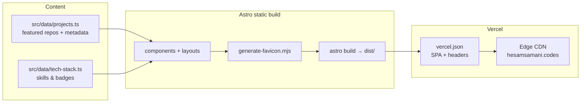

<div align="center">

# hesamsamani.codes

### Developer portfolio — projects, tools, and code

**Open-source Python desktop apps and AI-powered developer tools by Hesam Samani**

<br />

[](https://hesamsamani.codes)
[](https://astro.build/)
[](https://tailwindcss.com/)
[](https://vercel.com/)
[](https://www.typescriptlang.org/)

[What is this?](#what-is-this) · [How it works](#how-it-works) · [Features](#features) · [Quick start](#quick-start) · [Professional site](https://hesamsamani.me)

</div>

---

## What is this?

**hesamsamani.codes** is the developer-facing portfolio for **Hesam Samani** — showcasing open-source desktop applications, AI tooling, and education utilities.

Featured projects include:

| Project | Summary |
| --- | --- |
| [**Distilmark**](https://github.com/Hesamsamani/Distilmark) | 8-engine PDF → Markdown converter with PyQt6 UI and offline Ollama vision |
| [**CourseraGrab**](https://github.com/Hesamsamani/CourseraGrab) | Privacy-first Windows app to download enrolled Coursera courses for offline study |

The site is a fast, static Astro app — project cards, tech stack badges, and screenshots are driven from typed data files, not a headless CMS.

---

## How it works



1. Add or edit projects in **`src/data/projects.ts`** (name, tags, image, GitHub URL, featured flag).
2. **`npm run build`** runs the favicon script, then Astro emits static HTML to **`dist/`**.
3. **Vercel** picks up pushes to `main` (or manual deploy) and serves the site at **https://hesamsamani.codes**.

---

## Features

- **Project showcase** — screenshot cards with version badges, categories (Desktop · AI · Education), and deep links to GitHub
- **Tech stack section** — scannable skills aligned with the actual repos (Python, PyQt, Ollama, Astro, etc.)
- **Distinct from hesamsamani.me** — BIM professional narrative lives on the `.me` site; this repo is the builder / OSS hub
- **Static & fast** — no API routes, no database, no client-side framework overhead
- **Deploy docs included** — Vercel CLI, DNS, and GitHub profile setup guides in-repo

---

## Tech stack

| Area | Technology |
| --- | --- |
| Framework | Astro 6 (static output) |
| Language | TypeScript 5 |
| Styling | Tailwind CSS v4 |
| Hosting | Vercel (`vercel.json`) |
| Node | ≥ 22.12.0 |

---

## Quick start

```bash
git clone https://github.com/Hesamsamani/hesamsamani-codes.git
cd hesamsamani-codes
npm install
npm run dev      # http://localhost:4321
npm run build    # production build → ./dist/
npm run preview  # preview production build locally
```

### Project structure

```text
/
├── public/           # Static assets (images, favicon)
├── scripts/
│   └── generate-favicon.mjs
├── src/
│   ├── components/   # Astro UI components
│   ├── data/         # projects.ts, tech-stack.ts
│   ├── layouts/      # Page layouts
│   ├── pages/        # Routes (index.astro → /)
│   └── styles/       # Global CSS
├── DEPLOY.md              # Vercel deploy instructions
├── DNS-SETUP.md           # Domain & Vercel DNS guide
├── GITHUB-MANUAL-STEPS.md # GitHub profile & related setup
├── PIN-REPOS.md           # Pin featured repos on GitHub
└── vercel.json            # Vercel deployment config
```

---

## Deploy & DNS

1. **[DEPLOY.md](./DEPLOY.md)** — deploy to Vercel (CLI or dashboard)
2. **[DNS-SETUP.md](./DNS-SETUP.md)** — point **hesamsamani.codes** at the deployment

## GitHub profile setup

- **[GITHUB-MANUAL-STEPS.md](./GITHUB-MANUAL-STEPS.md)** — profile fields, repo topics, Pages, and Vercel checklist
- **[PIN-REPOS.md](./PIN-REPOS.md)** — pin featured repos on your GitHub profile (manual UI steps)

---

## Related

| Resource | URL |
| --- | --- |
| Live developer site | [hesamsamani.codes](https://hesamsamani.codes) |
| Professional BIM portfolio | [hesamsamani.me](https://hesamsamani.me) |
| GitHub profile | [github.com/Hesamsamani](https://github.com/Hesamsamani) |

---

<sub>Built by **Hesam Samani** · Python desktop tools · AI workflows · Hasselt, Belgium</sub>